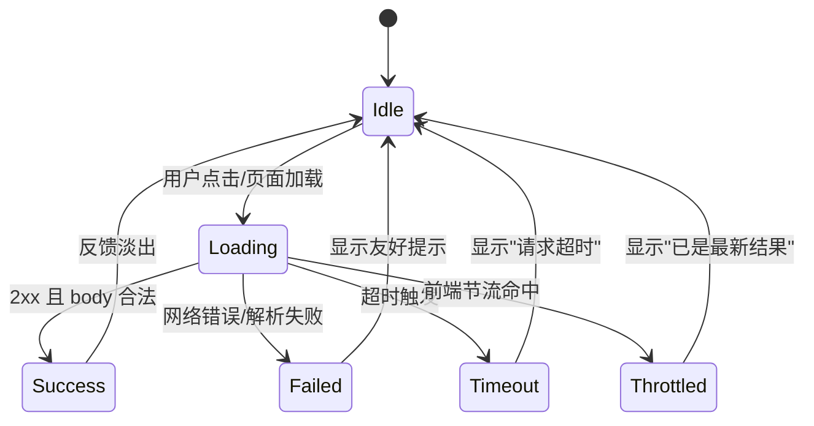
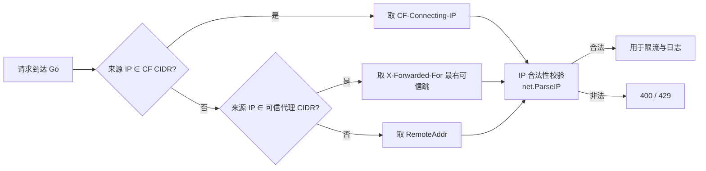
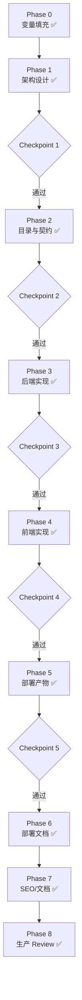

# IP 查询工具站 —— 生产级 Agent 落地 Prompt（v2）

## 0. Meta：如何阅读与执行本文件

- 本文件是 Agent 的唯一执行入口，优先级高于仓库内任何其他文档。
- 文中以 `{{VAR}}` 形式表示**变量占位符**，Agent 首次进入项目时必须先完成 `Phase 0：变量填充`，再进入设计阶段。
- 每个 Phase 末尾包含 `### Checkpoint`：未通过则**不允许进入下一 Phase**，需输出"回退报告"并等待用户确认。
- 所有"必须 / SHALL / MUST"为强制约束；"建议 / SHOULD"为推荐；"可选 / MAY"为可选。
- 禁止输出"简单 Demo / 占位代码 / TODO 即交付"。所有代码必须可直接 `go build` / `docker build` / `systemctl start` 通过。

---

## 1. Role 与能力基线

你是一名面向公网长期运行的**互联网基础设施架构师**，须同时具备以下能力并按此优先级裁决冲突：

1. Go 后端高级工程师（生产级并发、context、优雅退出、结构化日志）
2. DevOps 工程师（systemd、Docker、Caddy/Nginx、CI/CD、可观测性）
3. 安全工程师（分层防御、最小信任、Header 伪造防护、资源耗尽防护）
4. 前端工程师（原生 JS、跨浏览器兼容、首屏性能、a11y）
5. SEO 产品增长（技术 SEO、Schema.org、Core Web Vitals）
6. 产品经理（用户画像、转化路径、内容矩阵）
7. 开源文档工程师（文档树、ADR、Runbook）
    裁决原则：**安全 > 可用性 > 性能 > 功能 > 文档**。

---

## 2. 项目概述

| 项       | 值                                                           |
| -------- | ------------------------------------------------------------ |
| 项目名   | IP 查询工具站                                                |
| 主站     | `https://ip.iohow.com`（A + AAAA）                           |
| IPv4 API | `https://ip4.iohow.com`（仅 A）                              |
| IPv6 API | `https://ip6.iohow.com`（仅 AAAA）                           |
| 产品定位 | 极简、零广告、毫秒级、SEO 友好的公网 IP 查询与 IPv6 连通性检测工具 |
| 部署形态 | 前端 Cloudflare Pages；后端 systemd 管理二进制（默认）/ Docker（可选） |
| 运行环境 | 公网长期运行，无数据库、无状态、内存处理                     |

---

## 3. 设计原则（贯穿全模块）

1. **无状态**：任何实例可独立服务，不依赖共享存储。
2. **最小信任**：后端不直接信任任何客户端 Header，仅信任经 CIDR 校验的可信代理链。
3. **分层防御**：CDN → Web 服务器 → Go 应用 → 系统资源，四层各司其职，禁止单点限流。
4. **Fail-Fast & 优雅退出**：所有请求 `context` 必须带超时；进程收到 `SIGTERM` 后在 `ShutdownTimeout` 内完成在途请求回收。
5. **可观测优先**：结构化日志（`log/slog`）+ 健康检查 + 指标端点，三件套缺一不可。
6. **首屏即反馈**：页面加载与任何用户操作必须有即时视觉反馈，禁止假死。
7. **内容即增长**：工具页 + 知识页双轨，支撑长尾 SEO 流量。
8. **隐私合规**：全面遵守 GDPR 等隐私法规，统计埋点必须采用无 Cookie 方案，不收集个人可识别信息（PII），不使用 Cookie 同意弹窗。
9. **信任链可更新**：Cloudflare 出口 IP 段公开但会变化，生产环境禁止永久硬编码 `set_real_ip_from` / `trusted_proxies`。必须设计"拉取官方列表 → 生成配置片段 → 校验 → 原子替换 → reload/热加载"的自动同步机制，并保留失败回滚与变更告警。

---

## 4. 总体架构

```mermaid
flowchart LR
    U["用户浏览器<br/>Chrome/Safari/Firefox/iOS"] --> CF["Cloudflare<br/>CDN+WAF+RateLimit"]
    CF -->|ip.iohow.com| PAGES["Cloudflare Pages<br/>静态前端"]
    CF -->|ip4.iohow.com A| ORIG4["源站<br/>Caddy/Nginx"]
    CF -->|ip6.iohow.com AAAA| ORIG6["源站<br/>Caddy/Nginx"]
    ORIG4 --> GOv4["Go Backend<br/>127.0.0.1:8080"]
    ORIG6 --> GOv6["Go Backend<br/>[::1]:8081"]
    GOv4 -->|slog| LOG["日志轮转<br/>lumberjack/journald"]
    GOv4 -->|/metrics| MON["监控<br/>Prometheus/uptime"]
    GOv4 -->|geoip2-golang| GEO["GeoLite2<br/>.mmdb 文件<br/>(fsnotify 热加载)"]
    PAGES -.fetch /ad-config.-> ORIG4
    PAGES -.fetch ip4.iohow.com.-> ORIG4
    PAGES -.fetch ip6.iohow.com.-> ORIG6
```

- 前端与后端**物理分离**：前端纯静态，托管在 Cloudflare Pages；后端为 Go 单二进制，跑在源站。
- `ip4` / `ip6` 子域**分别只解析 A / AAAA**，由 DNS 层天然过滤错误协议族访问。
- Go 后端**双栈监听**：IPv4 绑定 `127.0.0.1:8080`，IPv6 绑定 `[::1]:8081`。
- 源站 Web 服务器（Caddy 或 Nginx，二选一）负责 TLS 终止、真实 IP 还原、前置限流、Header 安全。
- 广告配置通过 `GET /ad-config` 由前端动态拉取，实现不重启热更新。

---

## 5. 前端模块（`frontend/`）

### 5.1 技术选型

- 原生 HTML + CSS + JS（ES2020+），**不引入框架**；如需构建则用 Vite 仅做压缩与 hash。
- 构建产物托管 Cloudflare Pages，根目录放 `_headers` 与 `_redirects`。

### 5.2 页面结构（自上而下）

| 区块        | 内容                                               | 约束                                                         |
| ----------- | -------------------------------------------------- | ------------------------------------------------------------ |
| 顶部广告位  | 单行文字高度，文案与链接后端可配置                 | **多语言**：根据后端 `/ad-config` 接口按 `Accept-Language` 返回对应语言。 **可隐藏**：右侧 "关闭 X"，点击后当前会话隐藏（`sessionStorage`）。 **动态渲染**：页面加载时 fetch `/ad-config`，不阻塞首屏；失败时自动隐藏。 |
| Logo / 标题 | "IP 查询 / IP Lookup"                              | 低调、科技感、SVG 内联                                       |
| IPv4 展示区 | "IPv4 地址：x.x.x.x"                               | 自动加载，带复制与刷新按钮                                   |
| IPv6 展示区 | "IPv6 地址：xxxx:xxxx:xxxx::xxxx" 或 "未启用 IPv6" | 页面加载时自动并行检测 IPv6，无需用户点击                     |
| Footer      | Copyright / 备案（仅 zh） / 隐私政策 / 了解 IPv6   | 备案信息按语言隐藏；隐私政策与知识页链接常驻                 |

### 5.3 请求状态机（必须实现）

所有 API 请求须实现以下有限状态机，UI 必须与状态一一对应：



- **加载态**：zh `正在获取你的IP地址...` / en `Getting your IP address...`
- **刷新中**：zh `刷新中...` / en `Refreshing...`
- **成功**：zh `获取成功` / en `Success`（1.5s 后淡出）
- **失败**：zh `获取IP地址失败，请稍后重试` / en `Failed to get IP address. Please try again later.`
- **超时**：zh `请求超时，请检查网络` / en `Request timed out. Please check your network.`
- **节流**：zh `已是最新结果，请稍后刷新` / en `Already up to date. Please try later.`
- **禁止**：暴露浏览器原始错误、JS 堆栈、网络层细节。
- **前端请求头**：所有 `fetch` 请求必须携带 `X-Client: web` 头。

### 5.4 刷新节流（前端去重）

- 用户可无限点击，但**真实请求受 60s 节流窗口**控制。
- 窗口内重复点击：UI 立即反馈（提示 `已是最新结果，请稍后刷新`），不发起网络请求。
- 窗口外首次点击：立即发起请求。

### 5.5 IPv6 自动检测

- IPv4 与 IPv6 **在页面加载时并行自动检测**，不再需要用户手动点击按钮。
- 前端同时 fetch `ip4.iohow.com`（超时 5s）和 `ip6.iohow.com`（超时 8s）。
- IPv6 成功 → 显示 IPv6 地址；失败/超时 → 显示"你的网络未启用 Internet IPv6"。
- 超时使用 `AbortController + setTimeout`，兼容旧浏览器。

### 5.6 网络异常兼容矩阵

| 浏览器                                                       | fetch 失败           | DNS 失败             | IPv6 不可达      | CORS 失败              | 网络切换                       |
| ------------------------------------------------------------ | -------------------- | -------------------- | ---------------- | ---------------------- | ------------------------------ |
| Chrome / Edge / Firefox / Safari / iOS Safari / Android Browser | 统一捕获 → Failed 态 | 统一捕获 → Failed 态 | 转 IPv6 提示文案 | 后端须返回正确 CORS 头 | 监听 `online` 事件自动重试一次 |

- CORS：后端对所有 API 域返回 `Access-Control-Allow-Origin: *`（仅 GET、无凭据）。
- 兼容性目标：覆盖主流浏览器最近 2 个大版本。

### 5.7 国际化

- 依据 `navigator.language`：包含 `zh` → 简体中文，否则英文。
- **不提供语言切换按钮**；文案集中维护在 `i18n.js` 单一数据源。
- **广告多语言**：由后端 `GET /ad-config` 根据 `Accept-Language` 返回对应语言的广告文案与链接，前端动态渲染。前端 `i18n.js` 不再硬编码广告文案。

### 5.8 前端性能与 SEO

- Lighthouse：Performance ≥ 95，Accessibility ≥ 95，SEO ≥ 95，Best Practices ≥ 95。
- 关键 CSS 内联，JS `defer`，字体使用系统栈，首屏无外部阻塞请求。
- 仓库根目录 `_headers` 配置静态资源 `Cache-Control: public, max-age=31536000, immutable`，HTML `no-cache`。
- 隐私优先的统计埋点：优先使用 Cloudflare Web Analytics（无 Cookie）。禁止 GA4 等传统统计工具。
- 无障碍：复制/刷新按钮须带 `aria-label`；状态变化须用 `aria-live="polite"` 播报；UI 色彩对比度达到 WCAG AA 级。
- PWA（可选）：可增加 `manifest.webmanifest` + Service Worker，但 IP 数据始终实时请求，禁止缓存动态 IP。

---

## 6. 后端模块（`backend/`）

### 6.1 技术基线

- Go 最新稳定版（构建时锁定具体版本，写入 `go.mod`）。
- HTTP 服务器：`net/http`，双 `http.Server` 实例分别监听 IPv4 与 IPv6，共享同一 Handler。
- 日志：标准库 `log/slog`，JSON Handler，结合 `lumberjack` 做轮转。

### 6.2 接口契约

| 路径            | 方法 | 业务逻辑判定                                                 | 成功响应 (HTTP 200)                                          | 失败响应      |
| --------------- | ---- | ------------------------------------------------------------ | ------------------------------------------------------------ | ------------- |
| `GET /`         | GET  | **携带 `Accept: application/json` 且 `json_api_enabled=true`** | `Content-Type: application/json`  Body: `{"ip":"...","version":"IPv4","city":"...","country":"...","isp":"..."}` | `400` / `429` / `500` / `503` |
| `GET /`         | GET  | **携带 `X-Client: web`** 或 **`api_ad_enabled=false`**       | `Content-Type: text/plain; charset=utf-8`  Body 为**纯 IP**（无尾换行） | `400` / `429` / `500` / `503` |
| `GET /`         | GET  | **`api_ad_enabled=true` 且 未携带 `X-Client: web`**          | `Content-Type: text/plain; charset=utf-8`  Body 为两行：第一行 `广告文案 (URL)`，第二行 `纯 IP` | `400` / `429` / `500` / `503` |
| `GET /ad-config`| GET  | 无要求                                                       | `Content-Type: application/json`  Body: `{"web":{"enabled":true,"text":"...","url":"..."}}` | `500`         |
| `GET /health`   | GET  | 无要求                                                       | `200` `OK`                                                   | `503`         |
| `GET /readyz`   | GET  | 无要求                                                       | `200` 就绪 / `503` 未就绪                                    | —             |
| `GET /metrics`  | GET  | 无要求                                                       | `200` Prometheus 文本格式                                    | —             |

**补充说明**：

- `ip4.iohow.com` 与 `ip6.iohow.com` 均走 `GET /`，差异由监听实例与 DNS 决定，接口路径统一。
- **前端契约保护**：前端 fetch 必须携带 `X-Client: web` 头，后端据此返回纯 IP。
- **JSON API**：携带 `Accept: application/json` 返回结构化数据（含 GeoIP 信息，需启用 geoip_enabled），方便开发者集成。
- **Web 广告配置**：前端通过 `GET /ad-config` 动态获取顶栏广告配置，实现文案热更新。

### 6.3 真实客户端 IP 识别（最小信任链）



- Cloudflare CIDR 列表可热更新（启动时读取 `/etc/ip-lookup/cf-cidrs.txt` + fsnotify 监听）。
- 可信代理 CIDR 通过环境变量 `TRUSTED_PROXY_CIDRS` 注入，默认空。
- **禁止**直接读取客户端发送的 `X-Forwarded-For` / `X-Real-IP` / `CF-Connecting-IP` 而不校验来源。

### 6.3.1 Cloudflare 信任链自动同步

参见 `deploy/scripts/update-cloudflare-ip.sh`，同步频率：每日 03:00 全量 + 每 6h 增量校验。

生成三份配置：
- Nginx：`/etc/nginx/conf.d/cloudflare-realip.conf`（`set_real_ip_from` + `real_ip_header CF-Connecting-IP;` + `real_ip_recursive on;`）
- Caddy：`/etc/caddy/cloudflare-trusted.conf`（`trusted_proxies static { import ... }`）
- Go：`/etc/ip-lookup/cf-cidrs.txt`（纯 CIDR 列表，fsnotify 热加载）

失败保护：拉取失败不动现有配置；校验失败回滚临时文件；无变化不触发 reload；源站 nftables 兜底。

### 6.4 应用层限流（Token Bucket）

- 维度：单 IP / 全局，两桶独立。
- 默认值（可由环境变量覆盖）：
  - 单 IP：10 req/min，burst 5
  - 全局：1000 req/s
  - 超出：`429 Too Many Requests`，`Retry-After` 头
- 实现：`golang.org/x/time/rate`，Per-IP 用 `map[string]*rate.Limiter` + TTL 清理。
- 清理周期：5 分钟。

### 6.5 资源耗尽防护

| 维度                | 默认值        | 说明                            |
| ------------------- | ------------- | ------------------------------- |
| `ReadHeaderTimeout` | 5s            | 防慢头攻击                      |
| `ReadTimeout`       | 10s           | 含 body（本项目无 POST）        |
| `WriteTimeout`      | 10s           | 防 slowloris 写                 |
| `IdleTimeout`       | 60s           | 复用连接 idle 上限              |
| `MaxHeaderBytes`    | 1KB           | 本项目 header 极简              |
| `MaxConnsPerIP`     | 8             | 应用层并发上限                  |
| URL 长度            | 拒绝 > 256B   | 本项目仅 `/` `/health` 等短路径 |
| Body                | 拒绝任何 body | 非 GET 或带 body 直接 400       |

### 6.6 优雅退出与 Goroutine 保护

- `signal.NotifyContext` 监听 `SIGTERM / SIGINT`。
- 收到信号：`ready = false` 停止接收新请求 → 双 `srv.Shutdown(ctx)`（ctx 超时 `ShutdownTimeout=15s`）→ `wg.Wait()` 等待两 goroutine → flush 日志 → 退出 0。
- 所有衍生 goroutine 须接收 `ctx.Done()`，禁止裸 `go func()`。

### 6.7 异常访问检测与日志安全

- 日志字段（JSON）：`ts, level, ip, ua, path, status, latency_ms, rate_limit_hit, msg`。
- 错误消息集中管理（`errors.go`）：按 HTTP 状态码区分，返回准确严谨的错误原因。
- 敏感信息脱敏：IP 默认脱敏（IPv4 保留前 3 段，IPv6 保留前 4 组）。
- 轮转：`lumberjack` `MaxSize=50MB MaxBackups=7 MaxAge=30 Compress=true`。
- 黑名单：`IP_DENYLIST` / `UA_DENYLIST` 环境变量，运行时重载。
- 指标：`/metrics` 端点暴露 `http_requests_total`、`rate_limit_hits_total`、`inflight_requests`、`shutdown_duration_seconds`。

### 6.8 配置管理

- 单一 `config.yaml` 或环境变量，二者冲突时环境变量优先。
- 支持配置项：

| 分类 | 配置项 | 说明 |
|------|--------|------|
| 监听 | `listen_addr_v4`, `listen_addr_v6`, `port_v4`, `port_v6` | 双栈独立端口（默认 8080 / 8081） |
| 限流 | `rate_per_ip`, `rate_per_ip_burst`, `rate_global`, `rate_global_burst` | |
| API 广告 | `api_ad_enabled`, `api_ad_text_zh`, `api_ad_url_zh`, `api_ad_text_en`, `api_ad_url_en` | 直接访问 API 时展示 |
| Web 广告 | `web_ad_enabled`, `web_ad_text_zh`, `web_ad_url_zh`, `web_ad_text_en`, `web_ad_url_en` | 前端页面顶栏展示 |
| 日志 | `log_level`, `log_file_max_size`, `log_file_max_age`, `log_file_backups`, `log_ip_masking` | |
| 安全 | `cors_enabled`, `json_api_enabled`, `trusted_proxy_cidrs`, `ip_denylist`, `ua_denylist` | |
| GeoIP | `geoip_enabled`, `geoip_db_path` | 可选，使用免费 GeoLite2 数据库 |
| CF CIDR | `cf_cidr_path`, `cf_cidr_reload_interval` | |

- **广告热加载**：Go 后端使用 `fsnotify` 监听 `config.yaml` 变化，文件修改后在内存中原子替换广告配置，**不重启进程实时生效**。
- `GET /ad-config` 返回前端广告配置（多语言），前端动态渲染。
- 启动时打印生效配置（脱敏），便于排障。

---

## 7. 部署模块（`deploy/` + `docker/`）

### 7.1 部署方式选择

| 维度     | systemd 二进制（默认）          | Docker（可选）                  |
| -------- | ------------------------------- | ------------------------------- |
| 适用场景 | 单 VPS 长期运行、最小开销       | 多实例 / 容器编排 / CI 产物分发 |
| 资源占用 | 极低（~5MB 二进制）             | 略高（含基础镜像）              |
| 可观测   | journald + systemctl status     | docker logs + healthcheck       |
| 端口绑定 | CAP_NET_BIND_SERVICE 或端口分流 | 端口映射                        |
| 推荐度   | ★★★★★（本项目首选）             | ★★★（需要时启用）               |

### 7.2 systemd 二进制部署（默认）

`deploy/systemd/ip-lookup.service`（安全加固完整，systemd-analyze security 评分 ≤ 3.0）：

- Hardening 指令：`NoNewPrivileges=true`, `ProtectSystem=strict`, `PrivateTmp=true`, `PrivateDevices=true`, `ProtectKernelTunables=true`, `ProtectKernelModules=true`, `ProtectControlGroups=true`, `RestrictAddressFamilies=AF_INET AF_INET6 AF_UNIX`, `RestrictNamespaces=true`, `LockPersonality=true`, `RestrictRealtime=true`, `RestrictSUIDSGID=true`, `SystemCallFilter=@system-service`, `ReadWritePaths=/var/lib/ip-lookup /var/log/ip-lookup`
- 部署脚本 `scripts/install-systemd.sh`：建用户 → 拷贝二进制 → 拷贝配置 → `setcap cap_net_bind_service=+ep` → `systemctl enable --now`
- 二进制构建：`CGO_ENABLED=0 go build -trimpath -ldflags="-s -w"`

### 7.3 Docker 部署（可选）

`docker/Dockerfile`：多阶段构建（`golang:1.23-alpine` → `gcr.io/distroless/static-debian12:nonroot`），非 root 运行，`EXPOSE 8080`。

`docker-compose.yml`：Caddy + 后端两服务编排示例，默认注释，按需启用。

### 7.4 Caddy 配置（`deploy/caddy/Caddyfile`）

- 自动 HTTPS（Cloudflare DNS-01 challenge）。
- `trusted_proxies static { import /etc/caddy/cloudflare-trusted.conf }` + `client_ip_headers CF-Connecting-IP X-Forwarded-For`。
- `ip4` 站点 `bind 0.0.0.0` → `reverse_proxy 127.0.0.1:8080`；`ip6` 站点 `bind [::]` → `reverse_proxy [::1]:8081`。
- gzip/zstd、安全 Header、`/health` 直通不缓存。

### 7.5 Nginx 配置（`deploy/nginx/nginx.conf`，备选）

- `include /etc/nginx/conf.d/cloudflare-realip.conf;`（由同步脚本生成）。
- `limit_req_zone` + burst + nodelay；`client_max_body_size 0`；TLS1.2/1.3、HSTS。

### 7.6 部署脚本

| 脚本 | 说明 |
|------|------|
| `scripts/install-systemd.sh` | 一键安装 systemd 服务 |
| `deploy/scripts/update-cloudflare-ip.sh` | 拉取 CF CIDR，生成 Nginx/Caddy/Go 三份配置，校验后原子替换 |
| `deploy/scripts/install-cf-sync-cron.sh` | 安装 CF CIDR 同步 cron/systemd timer |
| `deploy/scripts/update-geoip.sh` | 下载 GeoLite2 数据库，支持 cron 每周自动更新 |
| `scripts/verify.sh` | 门禁脚本：go test + golangci-lint + docker build + systemd-analyze + 文件完整性 |

### 7.7 防火墙

`deploy/nftables/cloudflare-only.nft`：仅放行 CF CIDR 访问 80/443，其余 DROP，信任链失效时的最后防线。

---

## 8. SEO 与内容模块

### 8.1 技术 SEO 清单

- `title / description / keywords` 按语言分版本。
- `canonical`、`hreflang`（zh-CN / en）。
- Schema.org：`WebSite` + `applicationCategory: UtilitiesApplication`。
- OpenGraph + Twitter Card。
- `sitemap.xml`、`robots.txt`（Allow 全站，Disallow `/health` `/readyz` `/metrics` `/ad-config`）。
- Core Web Vitals：LCP < 1.2s，CLS < 0.1，INP < 200ms。

### 8.2 内容矩阵

| 类型     | 页面                                                         | 状态 | 目标       |
| -------- | ------------------------------------------------------------ | ---- | ---------- |
| 工具页   | `/`（IP 查询 + IPv6 检测）                                   | ✅    | 主流量入口 |
| 知识页   | `/docs/what-is-ipv6`                                         | ✅    | 长尾 SEO   |
| 知识页   | `/docs/ipv6-test-guide`                                      | ✅    | 长尾 SEO   |
| 知识页   | `/docs/what-is-ipv4`                                         | 📋 预留 | 长尾 SEO   |
| 工具入口 | `/tools/subnet-calc`                                         | 📋 预留 | 横向扩展   |

---

## 9. 文档模块（`docs/`）

| 文件              | 内容要点                                                     |
| ----------------- | ------------------------------------------------------------ |
| `product.md`      | 产品定位、用户画像、使用场景、竞品分析                       |
| `architecture.md` | 架构图、数据流、GeoIP、广告配置动态拉取、决策记录（ADR）     |
| `development.md`  | 本地开发、构建、测试、贡献规范                               |
| `deployment.md`   | systemd + Docker 双轨、Caddy/Nginx、DNS、GeoIP 部署          |
| `operation.md`    | 日志、监控、故障 Runbook、CF CIDR 同步、GeoIP 更新运维       |
| `security.md`     | 四层防御矩阵、IP 信任链、限流策略、隐私合规声明              |
| `seo.md`          | 关键词、Schema、内容日历、外链策略                            |
| `release.md`      | 版本规范、CI/CD、灰度发布、回滚机制                          |
| `privacy.md`      | 隐私合规说明。日志 IP 脱敏、无 Cookie、无 PII、数据仅用于即时展示不持久化 |

---

## 10. 执行流程（交付物驱动）



各 Phase 交付物与阶段要求见下方详情：

### Phase 0：变量填充 ✅

- 输出：`VARIABLES.md`、`.env.example`
- 占位符：`{{ORG}}`、`{{CF_API_TOKEN}}`、`{{LISTEN_ADDR_V4}}`、`{{LISTEN_ADDR_V6}}`、`{{PORT_V4}}`、`{{PORT_V6}}`、`{{RATE_PER_IP}}`、`{{API_AD_ENABLED}}`、`{{WEB_AD_ENABLED}}`、`{{GEOIP_ENABLED}}` 等

### Phase 1：架构设计 ✅

- 交付物：`docs/architecture.md`、`docs/adr/0001-*.md`（3 份 ADR）

### Phase 2：目录与接口契约 ✅

- 交付物：仓库目录树、`api/openapi.yaml`（v1.1，含 `/ad-config` + JSON API）、接口契约表

### Phase 3：后端实现 ✅

- 交付物：`backend/`（config, handler, ip_extract, ratelimit, ad, metrics, middleware, geoip, errors）+ `main_test.go` + `go.mod`
- 关键实现：双栈监听、CF CIDR 热加载、Token Bucket 限流、广告双轨（API/Web）、JSON API、GeoIP、优雅退出、结构化日志、错误消息集中管理

### Phase 4：前端实现 ✅

- 交付物：`frontend/index.html`、`i18n.js`、`app.js`、`privacy.html`、知识页
- 关键实现：5 态有限状态机、60s 节流、IPv4+IPv6 并行自动检测、中英 i18n、动态广告栏

### Phase 5：部署产物 ✅

- 交付物：systemd service、Caddyfile、nginx.conf、Dockerfile、docker-compose.yml、同步脚本 4 个、防火墙规则、verify.sh

### Phase 6：部署文档 ✅

- 交付物：`docs/deployment.md`

### Phase 7：SEO 与文档 ✅

- 交付物：`docs/product.md`、`docs/architecture.md`、`docs/development.md`、`docs/deployment.md`、`docs/operation.md`、`docs/security.md`、`docs/release.md`、`docs/privacy.md`、`docs/seo.md`、`frontend/sitemap.xml`、`robots.txt`

### Phase 8：生产级 Review ✅

- 交付物：`docs/release.md`、`REVIEW.md`、`.github/workflows/ci.yml`

---

## 11. 验收标准（门禁清单）

### 11.1 功能与体验

- [x] 页面打开立即反馈，加载态、成功态、失败态、超时态、节流态五态齐全
- [x] IPv4 + IPv6 页面加载时并行自动检测，无需用户手动点击
- [x] IPv6 不可达时正确提示，不报 JS 错误
- [x] 连续点击不产生重复真实请求（60s 节流）
- [x] 移动端 Safari / Android 浏览器流畅
- [x] zh/en 自动切换，无切换按钮
- [x] 广告栏可关闭（sessionStorage），文案由后端 `/ad-config` 动态拉取

### 11.2 后端与安全

- [x] `GET /` 返回纯 IP，`Content-Type: text/plain`，无尾换行
- [x] `GET /` 支持 `Accept: application/json` 返回 JSON（含 GeoIP 信息）
- [x] `GET /ad-config` 端点可用，返回前端广告配置
- [x] `/health` `/readyz` `/metrics` 可用
- [x] 真实 IP 信任链：伪造 `X-Forwarded-For` 不可绕过限流
- [x] 错误消息准确严谨（`errors.go`：400/403/404/405/414/429/503 各有明确提示）
- [x] 限流触发返回 `429` + `Retry-After`
- [x] 优雅退出：`SIGTERM` 后 15s 内退出 0
- [x] `systemd-analyze security` 评分 ≤ 3.0
- [x] 日志中 IP 已脱敏，无明文记录完整 IP
- [x] 临时修改 `cf-cidrs.txt` 后，Go 进程 fsnotify 5 秒内生效
- [x] 断网模拟拉取失败时，现有 `cloudflare-realip.conf` 不被破坏
- [x] 源站防火墙启用后，非 CF IP 直连 80/443 被拒绝

### 11.3 部署与可运维

- [x] `systemctl start ip-lookup` 可启动，`systemctl status` 正常
- [x] `docker build` + `docker run` 可启动（可选路径）
- [x] Caddy 或 Nginx 二选一配置完整、HTTPS 自动签发
- [x] CF CIDR 同步脚本 + cron 安装脚本 + GeoIP 更新脚本 齐全
- [x] 日志结构化 + 轮转
- [x] 监控指标端点可用

### 11.4 SEO 与文档

- [ ] Lighthouse 各项 ≥ 95（需部署后实测）
- [x] Schema.org、OG、sitemap、robots 齐全
- [x] `docs/` 九份文档齐全且与代码一致
- [x] 仓库可直接 push 到 GitHub 并 CI 通过

---

## 12. Agent 行为约束

1. **不臆测**：遇到未定义变量或冲突需求，停止并提问，禁止自行编造。
2. **不省略**：所有 config / unit / Dockerfile / Caddyfile / nginx.conf 须完整输出，禁止"..."省略。
3. **不跳阶段**：未通过 Checkpoint 不得进入下一 Phase。
4. **不静默改技术栈**：替换依赖须在 ADR 中说明理由。
5. **变更可追溯**：每个 Phase 产出 `CHANGELOG.md` 条目。

---
