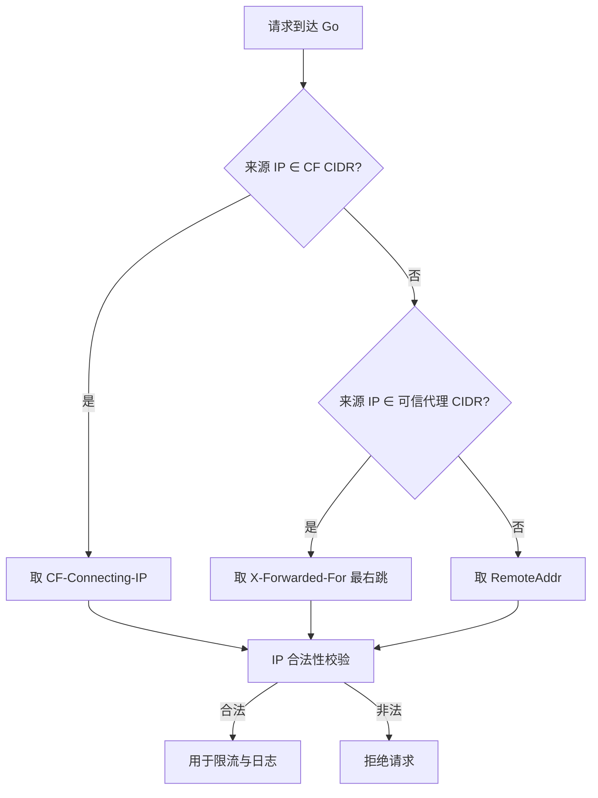

# 安全文档

## 四层防御矩阵

| 层级 | 组件 | 防御措施 |
|------|------|----------|
| L1 CDN | Cloudflare | WAF、DDoS 防护、边缘速率限制、TLS 终止 |
| L2 Web 服务器 / CDN 头 | Caddy / Nginx / _headers | 真实 IP 还原、前置限流、安全 Header（CSP + Permissions-Policy + HSTS）、请求体拒绝 |
| L3 Go 应用 | ip-lookup | IP 信任链、`cf_only` 只接受 CF/受信代理来源、应用层限流（可关）、黑名单（IP+UA+CIDR）、Panic 恢复、超时控制、并发安全（atomic/mutex）、安全响应头、请求 ID 追踪 |
| L4 系统 | systemd + nftables | 资源隔离（systemd hardening）、源站防火墙（仅 CF CIDR） |

---

## IP 信任链



**禁止**直接信任客户端发送的代理头而不校验来源。

### CF CIDR 热更新

`/etc/ip-lookup/cf-cidrs.txt` 由自动同步脚本维护，Go 进程通过 fsnotify 监听，文件变更后 200ms debounce 原子替换内存中的可信 CIDR 集合；另有 `cf_cidr_reload_interval`（默认 5m）兜底定时器周期重载，防 fsnotify 事件丢失，无需重启进程。

---

## 限流策略

| 维度 | 速率 | Burst | 超出响应 |
|------|------|-------|----------|
| 单 IP | 10 req/min | 5 | `429` + `Retry-After: 6` |
| 全局 | 5000 req/s | 5000 | `429` + `Retry-After: 1` |

- 两桶独立：单 IP / 全局
- `rate_enabled` 总开关（调试可关）、`rate_mode`（both/per_ip/global），均支持热加载
- 5 分钟 TTL 清理空闲桶

---

## 黑名单

- `IP_DENYLIST`：IP 或 CIDR 逗号分隔
- `UA_DENYLIST`：UA 子串逗号分隔（大小写不敏感）
- 匹配返回 `403 Forbidden`

---

## Go 应用层安全

| 维度 | 默认值 | 说明 |
|------|--------|------|
| ReadHeaderTimeout | 5s | 防慢头攻击 |
| ReadTimeout | 10s | 含 body 读取 |
| WriteTimeout | 10s | 防 slowloris 写 |
| IdleTimeout | 60s | 复用连接 idle 上限 |
| MaxHeaderBytes | 1KB | 本项目 header 极简 |
| MaxConnsPerIP | 8 | 单 IP 并发上限（TryAcquire/Release 原子操作） |
| URL 长度 | > 256B 拒绝 | 仅 `/`、`/all`、`/health` 等短路径 |
| Body | 拒绝任何 body | ContentLength 先验 + Body 后关 |
| Panic 恢复 | recovery 中间件 | 防止进程崩溃 |
|并发安全 | atomic.Bool + sync.Mutex | `ready` 标志、`connCounter`、`Config` 热重载均无 data race |
|黑名单 | IP 精确 + CIDR 段 + UA 子串 | `denylistMiddleware`，大小写不敏感 |
|中间件链 | 11 层顺序执行 | requestID → recovery → securityHeaders → metrics → methodCheck → bodyRejection → denylist → connLimit → cors → logging |
|请求 ID 追踪 | 8 字节随机 hex | `X-Request-ID` header 入/出，日志中无此 ID 但可用于下游关联 |
|安全响应头 | Go 中间件层覆写 | `X-Content-Type-Options`、`X-Frame-Options`、`Referrer-Policy`，不等同依赖于反向代理 |
| Nginx 安全头（备用代理层） | Nginx `add_header` | `Permissions-Policy`（浏览器 API 权限限制）、`Cache-Control` 健康检查端点 |

---

## 错误消息安全

后端错误消息集中管理于 `errors.go`，按 HTTP 状态码分化：

| 状态码 | 返回消息 | 说明 |
|--------|----------|------|
| 400 | `Bad Request: invalid request` | 请求格式错误 |
| 403 | `Forbidden` | 黑名单拦截 |
| 404 | `Not Found` | 路径不存在 |
| 405 | `Method Not Allowed` | 非 GET 请求 |
| 414 | `Bad Request: URL too long` | URL 超限 |
| 429 | `Too Many Requests: rate limit exceeded, please retry later` | 限流 |
| 503 | `Service Unavailable` | 服务不可用 |

消息准确严谨，不暴露内部细节（堆栈、文件路径、版本号）。

---

## Metrics 端点

Prometheus 指标端点 `/metrics` 在独立端口监听（默认 `127.0.0.1:9090`），仅本地可达，不通过反向代理暴露到公网。配置项 `metrics_listen_addr` 可自定义监听地址，设置为 `0.0.0.0:9090` 可对外暴露。

---

## Content-Security-Policy

前端托管于 Cloudflare Pages，`_headers` 文件中配置 CSP：

```
Content-Security-Policy: default-src 'self';
  connect-src 'self' https://ip4.iohow.com https://ip6.iohow.com;
  img-src 'self' data:;
  style-src 'unsafe-inline' 'self';
  script-src 'self';
  frame-ancestors 'none'
```

| 指令 | 允许源 | 说明 |
|------|--------|------|
| `default-src` | `'self'` | 所有未显式指定指令的 fallback |
| `connect-src` | `'self'` + `ip4.iohow.com` + `ip6.iohow.com` | 前端 fetch API 调用目标 |
| `style-src` | `'unsafe-inline'` + `'self'` | 内联 CSS（`<style>` 标签） |
| `script-src` | `'self'` | 仅同源 JS（`js/i18n.js`、`js/app.js`） |
| `frame-ancestors` | `'none'` | 禁止 iframe 嵌套（防 clickjacking） |

---

## systemd Hardening

| 指令 | 作用 |
|------|------|
| `NoNewPrivileges=true` | 禁止子进程获取新权限 |
| `ProtectSystem=strict` | 只读文件系统 |
| `ProtectHome=true` | 禁止访问 /home |
| `PrivateTmp=true` | 独立临时目录 |
| `PrivateDevices=true` | 禁止访问设备 |
| `ProtectKernelTunables=true` | 禁止修改内核参数 |
| `ProtectKernelModules=true` | 禁止加载内核模块 |
| `ProtectControlGroups=true` | 禁止修改 cgroups |
| `RestrictAddressFamilies=AF_INET AF_INET6 AF_UNIX` | 限制网络协议族 |
| `RestrictNamespaces=true` | 禁止创建 namespace |
| `RestrictRealtime=true` | 禁止实时调度 |
| `RestrictSUIDSGID=true` | 禁止 SUID/SGID 位 |
| `SystemCallFilter=@system-service` | 限制系统调用 |
| `CapabilityBoundingSet=CAP_NET_BIND_SERVICE` | 仅允许绑定特权端口 |

---

## GeoIP 隐私说明

启用 GeoIP 后，后端可根据客户端 IP 查询城市、国家、ISP 和 ASN 信息。
- 这些信息**仅用于即时 API 响应展示**，不持久化存储。
- 查询结果通过 JSON 返回：携带 `Accept: application/json` 的 `/` 请求，或 `all_api_enabled=true` 时的 `/all` 路由。
- 纯文本 API 请求不受影响，仍只返回 IP 字符串。
- 地名按 `Accept-Language` 返回 `zh-CN`/`en`；ASN 组织名仅英文。
